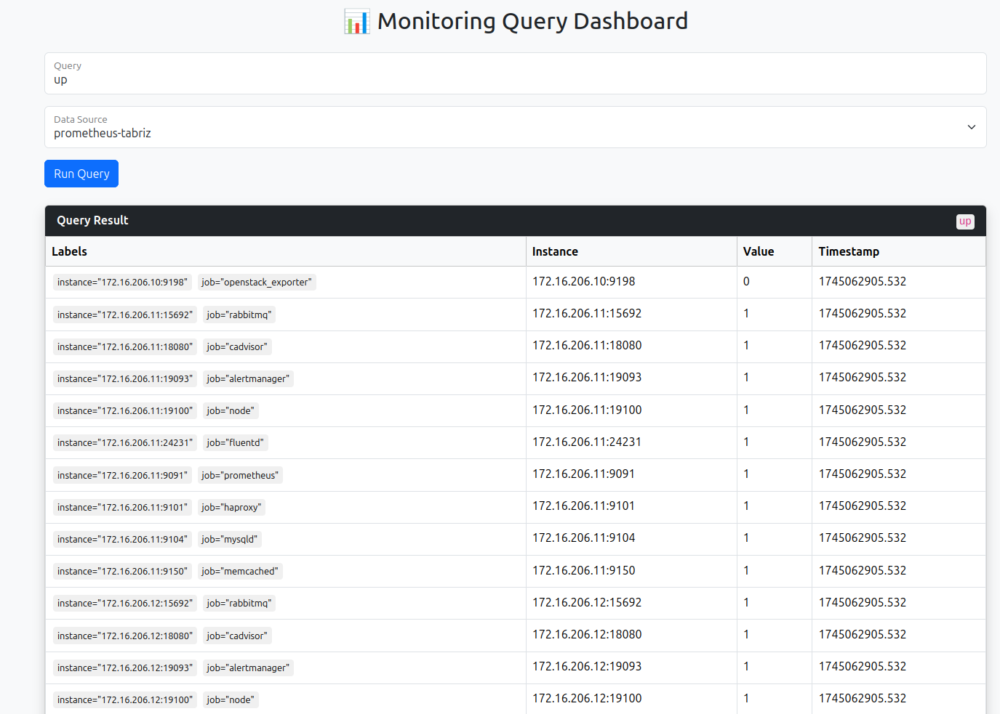

# 📊 Monitoring Query Dashboard

A lightweight Python + Flask dashboard that connects to **multiple Prometheus-compatible datasources** like **Prometheus** and **VictoriaMetrics**. It offers:

- ✅ Web UI to explore metrics visually
- ✅ REST API to query metric values for automation or integrations

---

## 🚀 Features

- 🔌 Supports multiple datasources (e.g., Prometheus, VictoriaMetrics)
- 🧪 PromQL support (query any metric)
- 🌐 Web UI with Bootstrap styling
- 🔁 REST API for easy programmatic access
- 📄 Easy to integrate in DevOps workflows

---

## 🖼️ Web UI Preview



---

## 📦 REST API

### POST `/query-metric`

Query any metric from the given Prometheus/VictoriaMetrics-compatible datasource.

#### Request Body

```json
{
  "query": "up",
  "datasource": "https://<your-prometheus-or-victoria-url>/"
}

